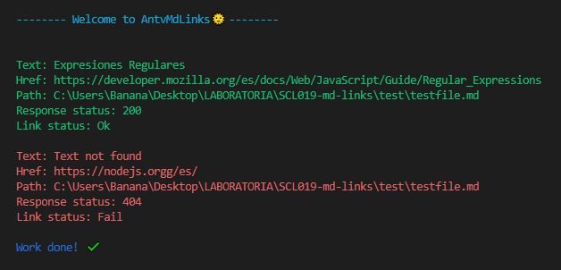

# AntvMdLinks 🌞

## Índice

* [Sobre AntvMdLinks](#1-sobre-AntvMdLinks)
* [Instalación](#2-instalación)
* [Guía de uso](#3-guía-de-uso)

***

## Sobre AntvMdLinks
Esta es una librería que permite extraer, leer y verificar la validez de los links presentes dentro de archivos con formato .md (markdown). 

## Instalación
Para poder instalar esta librería debes tener instalado Node.js de forma previa. Luego debes ejecutar el siguiente comando en la terminal: 

` npm install antv-mdlinks`

## Guía de uso
Con la librería ya instalada, debes ingresar el comando 'antv-mdlinks' junto con la ruta a analizar más una de las opciones dadas.

`antvmdlinks <path> [option]`

### Opciones

`--stats` este argumento nos entrega la cantidad de links existentes dentro del archivo .md y la cantidad de links no duplicados que posee (total y unique).

`--validate` este argumento retorna las propiedades de los links presentes junto con su validación (ok o fail). Los links de color verde funcionan correctamente y los que se muestran con color rojo corresponden a links rotos o inválidos.

### Visualización en la terminal
Uso de --stats:

Uso de --validate:

### Creado por:

* Anabella Lincopán

